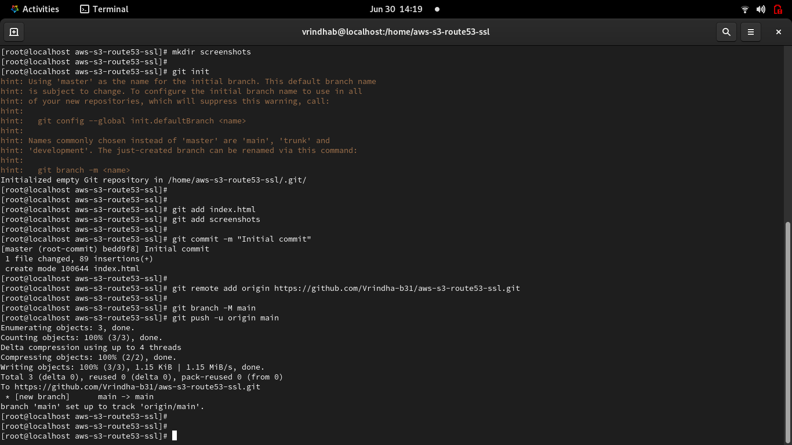
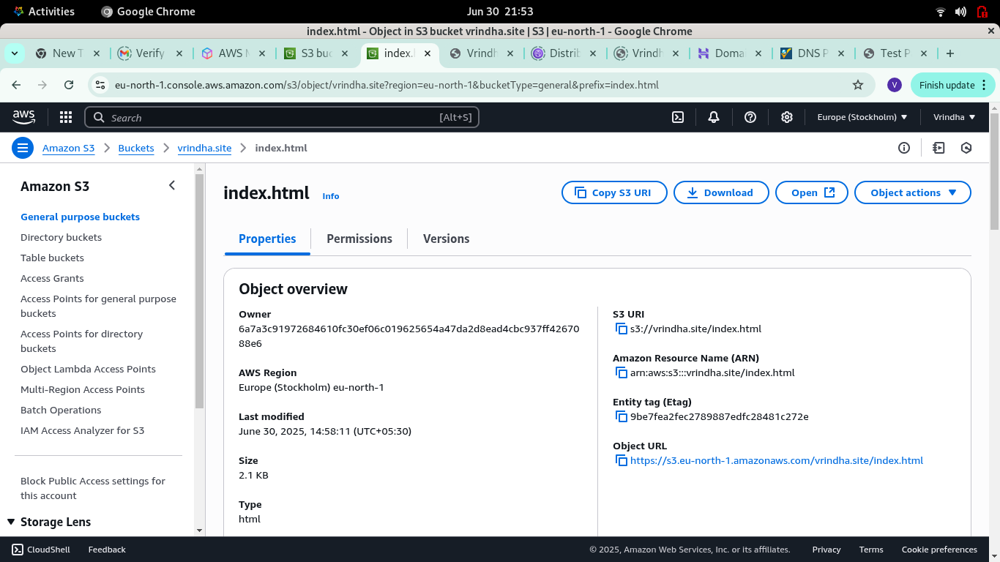
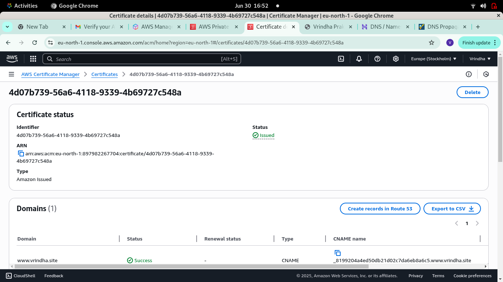
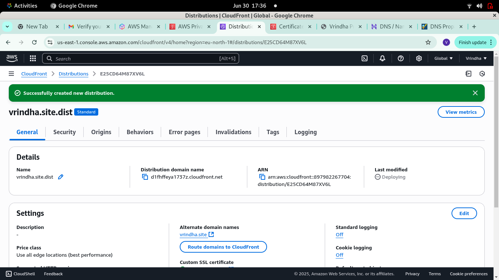
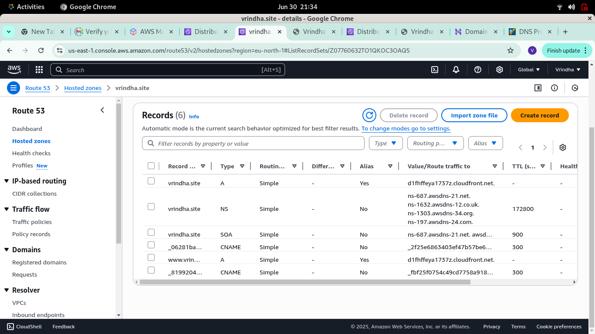
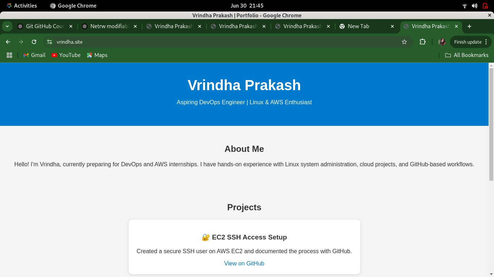

# Project: Host a Secure Static Website on AWS with Custom Domain

## ✅ Objective
Host a static website on a custom domain (`vrindha.site`) using AWS services with SSL and global CDN.

## 🔧 Technologies Used
- Amazon S3 (Static Website Hosting)
- Amazon Route 53 (DNS & Domain Management)
- AWS ACM (Free SSL Certificate)
- Amazon CloudFront (CDN + HTTPS)
- Git & GitHub (Documentation & Codebase)

## 🛠️ Steps Performed
1. Created an S3 bucket named `vrindha.site`
2. Enabled static website hosting and uploaded `index.html`
3. Set up bucket policy to allow public read access
4. Requested and validated a free SSL cert from ACM
5. Created a CloudFront distribution with custom domain + SSL
6. Configured Route 53 to point `vrindha.site` and `www.vrindha.site` to CloudFront
7. Enabled HTTPS redirection in CloudFront behavior
8. Verified secure access via `https://vrindha.site`

## 🌐 Live Demo
[https://vrindha.site](https://vrindha.site)

## 📸 Screenshots
## Screenshot References

### Git push

### S3 Bucket with static website hosting enables 

### ACM Certificate showing Issued status

### CloudFront distribution settings

### Route 53 records

### Live & Secured site in browser

